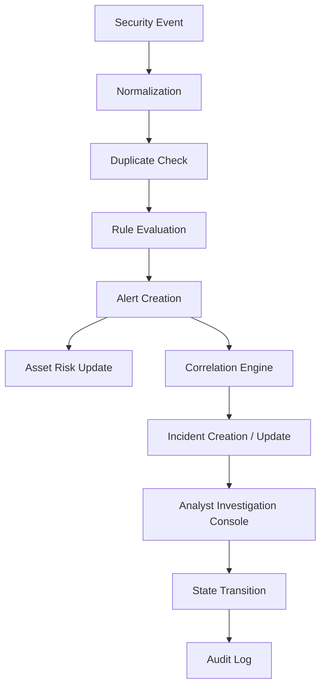
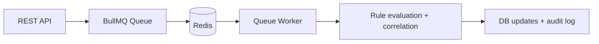

# ThreatSync OS

ThreatSync OS is a portfolio-quality security operations and investigation platform demo built with Next.js, NestJS, Prisma, and Redis/BullMQ.

> This project is a local implementation for technical demonstration and portfolio review. It is not connected to live SIEM/EDR telemetry, does not claim production deployment, and does not perform autonomous external security response.

[](#verification) [](#tech-stack) [](LICENSE)

---

## What this project demonstrates

ThreatSync OS models the core workflows of a SOC investigation workflow in a local, deterministic environment:

- Event ingestion and schema normalization
- Duplicate detection and rule-based alert generation
- Alert-to-incident correlation using shared context
- Explainable asset risk scoring
- Tenant-aware authorization and audit logging
- Async queue processing with BullMQ + Redis

This is not a live production SOC environment. It is a realistic engineering project that demonstrates how these systems are structured and validated in a controlled local demo.

---

## Architecture at a glance

### Data flow



### Async processing path



### Stack layers

```text
Next.js App Router (dashboard / investigation UI)
        |
   Typed API client
        |
  NestJS REST API + guards + middleware
        |
  Domain services and request-scoped authorization
        |
  Prisma ORM + PostgreSQL / local SQLite-backed demo data
```

---

## What is implemented and what is not

### Implemented in this repo

- Deterministic event normalization and duplicate suppression
- Rule-driven alert generation against explicit conditions
- Asset risk scoring with per-factor contributors
- Alert-to-incident correlation logic
- Incident lifecycle transitions with audit records
- JWT + tenant-bound authorization checks
- BullMQ queue processing with Redis-backed execution when configured

### Not claimed here

- Live SIEM ingestion from external enterprise infrastructure
- Live EDR telemetry streams
- Autonomous AI-driven decision making
- Production deployment or managed cloud rollout

---

## Local threat intelligence vs external provider configuration

ThreatSync OS distinguishes between two intelligence paths clearly:

1. Local deterministic intelligence
   - Default behavior in the demo environment
   - Uses repository-backed or seeded local data for investigation and IOC matching
   - Suitable for demos, deterministic testing, and portfolio validation

2. External configured provider path
   - Intended for an environment where provider credentials/config are supplied externally
   - Not required for the base project to run locally
   - The code abstracts the provider boundary and preserves the default local path

This distinction is explicit in the investigation logic and should be described as such during portfolio presentations.

---

## Why this is a strong engineering portfolio project

### 1. Security-by-structure, not just visual polish

The project enforces tenant-aware access patterns and service-layer validation rather than making the UI look secure without backend enforcement.

### 2. Deterministic behaviors are easier to explain

Rules fire only when explicit conditions match. The project favors clear data flow and explainable logic over opaque analytics.

### 3. Real engineering trade-offs are visible

The project includes queue decoupling, Redis boundary enforcement, idempotency checks, and audit logging — all common concerns in real SOC systems without over-claiming production maturity.

### 4. The demo remains grounded in evidence

The dashboard and API are designed around the actual system data model and seeded local scenario, not an imagined enterprise environment.

---

## Verification

The project has been fully audited and validated with the following evidence:

- 17 test suites passed (100%)
- 119 tests passed (100%)
- API build succeeded
- Web build succeeded (24/24 static pages compiled)
- Redis-backed async queue path accepted and processed live events
- SSRF protections verified with redirect suppression and private network range validation
- Integrations RBAC mutation enforcement verified (HTTP 403 for non-admins)

See the related implementation in [apps/api/src/queues/queue.service.ts](apps/api/src/queues/queue.service.ts), [apps/api/src/queues/queue.worker.ts](apps/api/src/queues/queue.worker.ts), and [apps/api/src/notifications/notifications.service.ts](apps/api/src/notifications/notifications.service.ts).

---

## Quick start

```bash
npm install
npm run db:push
npm run db:seed
npm run dev --workspace=apps/web
npm run dev --workspace=apps/api
```

Demo login credentials seeded in the local environment:

- Email: `analyst@threatsync.local`
- Password: `ThreatSyncSecured2026!`

---

## Project structure

```text
threat/
├── apps/
│   ├── api/
│   └── web/
├── packages/
│   ├── database/
│   └── shared-types/
├── docs/
├── README.md
├── netlify.toml
├── package.json
└── tsconfig.json
```

---

## Relevant docs

- [docs/ARCHITECTURE.md](docs/ARCHITECTURE.md)
- [docs/CASE_STUDY.md](docs/CASE_STUDY.md)
- [docs/DEMO_SCRIPT.md](docs/DEMO_SCRIPT.md)
- [docs/INTERVIEW_NOTES.md](docs/INTERVIEW_NOTES.md)
- [docs/PORTFOLIO_COPY.md](docs/PORTFOLIO_COPY.md)
- [docs/API_CONTRACTS.md](docs/API_CONTRACTS.md)

**Request-scoped services for tenant isolation**  
→ Services injected with `Scope.REQUEST` receive a fresh instance per HTTP request, with the tenant `organizationId` bound to that request's JWT context. No cross-request state leakage is possible.  
→ Tradeoff: Request-scoped providers cannot be singleton. BullMQ worker processes bypass this by resolving tenant context from the job payload and validating it against the database.

**Explicit incident state transitions**  
→ State changes are validated against `ALLOWED_STATUS_TRANSITIONS` before any write. This prevents invalid states (e.g., `RESOLVED → CONTAINMENT_IN_PROGRESS`) and creates a deterministic audit trail.  
→ Tradeoff: Analysts cannot skip states even if a workflow demands it. This is a deliberate correctness constraint.

---

## Capability Scope

| Capability | Status |
|:--|:--|
| Security event ingestion & normalization | ✅ Implemented |
| Event deduplication (5-minute window) | ✅ Implemented |
| Detection rule evaluation | ✅ Implemented |
| Confidence scoring per alert | ✅ Implemented |
| Rule suppression periods | ✅ Implemented |
| Alert correlation into incidents | ✅ Implemented |
| Duplicate incident prevention | ✅ Implemented |
| Explainable asset risk scoring | ✅ Implemented |
| Multi-tenant authorization | ✅ Implemented |
| IDOR protection (fail-closed) | ✅ Implemented |
| Incident state machine | ✅ Implemented |
| Audit logging for mutations | ✅ Implemented |
| Investigation timelines (deterministic) | ✅ Implemented |
| Async queue processing (BullMQ) | ✅ Implemented |
| Idempotent queue workers | ✅ Implemented |
| Production Redis boundary enforcement | ✅ Implemented |
| Threat intelligence provider abstraction | ✅ Implemented |
| External threat intelligence (VirusTotal/AbuseIPDB) | ⚙️ Provider abstraction — requires API key configuration |
| Live SIEM/EDR connectors | ❌ Out of scope — seeder provides representative data |
| Autonomous remediation | ❌ Out of scope — analyst-driven via UI controls |
| Real production telemetry | ❌ Out of scope — not connected to live infrastructure |

---

## Demo Setup

### Prerequisites
- Node.js ≥ 18, npm ≥ 9
- Redis (optional in dev — set `ENABLE_IN_MEMORY_QUEUE_FALLBACK=true` to skip)
- PostgreSQL or SQLite (SQLite configured by default)

### Setup

```bash
# 1. Install all workspace dependencies
npm install

# 2. Configure environment
cp .env.example .env
# Edit .env — set DATABASE_URL and JWT_SECRET at minimum

# 3. Generate Prisma client and push schema
npm run db:generate
npm run db:push

# 4. Seed development data
npm run db:seed
# → Creates analyst@threatsync.local / ThreatSyncSecured2026!
# → Populates 50 assets, 150 alerts, 12 incidents, 500 events, 25 IOCs (DEMO DATA)

# 5. Launch development servers
npm run dev:api    # http://localhost:3001
npm run dev:web    # http://localhost:3000
```

### Demo Login
> **Development credentials only — not for production use**
- Email: `analyst@threatsync.local`
- Password: `ThreatSyncSecured2026!`

### Recommended Walkthrough (90 seconds)

1. **Overview** (`/dashboard`) — active alerts, open incidents, asset risk distribution
2. **Alerts** (`/dashboard/alerts`) — open `Failed administrator kerberos ticket request`
3. **Alert detail** (`/dashboard/alerts/[id]`) — detection rule, confidence score, source IP
4. **Incident** — follow the linked incident badge
5. **Incident Timeline** — chronological sequence: event → detection → alert → triage actions
6. **Assets & Risk tab** — open a seeded asset → inspect its explainable risk score on a 0–100 scale and mapped vulnerabilities
7. **IOC** — inspect `198.51.100.99` → enrichment data, observed alerts, related events
8. **Response Controls tab** — transition incident from `OPEN` → `TRIAGED`
9. **Add analyst note** — post an investigation observation
10. **Audit** (`/dashboard/audit`) — confirm `INCIDENT_STATUS_TRANSITION` audit entry with entity link

---

## Code Navigation for Reviewers

| If you want to understand | Start here |
|:--|:--|
| Event ingestion, normalization, deduplication | [`apps/api/src/events/events.service.ts`](apps/api/src/events/events.service.ts) |
| Detection rule evaluation & confidence scoring | [`apps/api/src/events/events.service.ts`](apps/api/src/events/events.service.ts) — `runDetections()`, `matchRule()` |
| Alert correlation into incidents | [`apps/api/src/queues/correlation.service.ts`](apps/api/src/queues/correlation.service.ts) |
| Explainable risk score formula | [`apps/api/src/assets/assets.service.ts`](apps/api/src/assets/assets.service.ts) — `buildRiskSummary()` |
| Tenant isolation & IDOR protection | [`apps/api/src/common/tenant-scoped.repository.ts`](apps/api/src/common/tenant-scoped.repository.ts) |
| Authentication & tenant guard | [`apps/api/src/auth/tenant.guard.ts`](apps/api/src/auth/tenant.guard.ts), [`jwt-auth.guard.ts`](apps/api/src/auth/jwt-auth.guard.ts) |
| Incident state machine & audit records | [`apps/api/src/incidents/incidents.service.ts`](apps/api/src/incidents/incidents.service.ts) |
| Investigation entity graph (Alert/Incident/Asset/IOC) | [`apps/api/src/investigation/`](apps/api/src/investigation/) |
| Async BullMQ queue setup & Redis boundary | [`apps/api/src/queues/queue.service.ts`](apps/api/src/queues/queue.service.ts) |
| Async worker with idempotency & tenant validation | [`apps/api/src/queues/queue.worker.ts`](apps/api/src/queues/queue.worker.ts) |
| Threat intelligence provider abstraction | [`apps/api/src/intelligence/threat-intel.provider.ts`](apps/api/src/intelligence/threat-intel.provider.ts) |
| Centralized typed frontend API client | [`apps/web/lib/api-client.ts`](apps/web/lib/api-client.ts) |
| Incident investigation console | [`apps/web/app/dashboard/incidents/[id]/page.tsx`](apps/web/app/dashboard/incidents/%5Bid%5D/page.tsx) |
| Investigation timeline component | [`apps/web/components/InvestigationTimeline.tsx`](apps/web/components/InvestigationTimeline.tsx) |
| Security & tenant isolation tests | [`apps/api/src/investigation/investigation.spec.ts`](apps/api/src/investigation/investigation.spec.ts) |
| Queue hardening tests | [`apps/api/src/queues/queue-hardening.spec.ts`](apps/api/src/queues/queue-hardening.spec.ts) |

---

## Technical Documentation

| Document | Contents |
|:--|:--|
| [`docs/ARCHITECTURE.md`](docs/ARCHITECTURE.md) | System layers, monorepo layout, entity relationships |
| [`docs/SECURITY_MODEL.md`](docs/SECURITY_MODEL.md) | Auth flow, tenant isolation, RBAC, IDOR protections, audit |
| [`docs/EVENT_PIPELINE.md`](docs/EVENT_PIPELINE.md) | Ingestion, normalization, detection, async queue, risk math |
| [`docs/INVESTIGATION.md`](docs/INVESTIGATION.md) | Entity tracing, investigation APIs, timeline construction |
| [`docs/LIMITATIONS.md`](docs/LIMITATIONS.md) | Honest scope boundaries, local fallbacks, dev-only data |
| [`docs/API_CONTRACTS.md`](docs/API_CONTRACTS.md) | REST endpoints, query parameters, payload schemas, responses |

---

## Engineering Questions This Project Supports

These are questions a technical interviewer could legitimately ask based on the implementation:

1. How does tenant isolation work, and where specifically is `organizationId` bound?
2. Why does the system return `404` instead of `403` for cross-tenant access attempts?
3. How is event deduplication implemented, and what is the window?
4. How are detection rules evaluated — what determines a match?
5. How is alert confidence score calculated?
6. How does the correlation engine decide whether to create a new incident vs. attach to an existing one?
7. How is risk score calculated, and what are the contributor categories?
8. Why use BullMQ for async ingestion rather than processing synchronously?
9. How does the worker prevent duplicate processing from BullMQ's at-least-once delivery?
10. What happens if Redis is unavailable in production — specifically at startup?
11. Why use a provider abstraction for threat intelligence?
12. How does the incident state machine prevent invalid transitions?
13. Why use request-scoped NestJS services for tenant isolation?
14. How would you add a new detection rule category?
15. What would you change before deploying this to handle real production load?

---

## What I Would Build Next

These are not implemented. Listed to demonstrate engineering judgment:

- **Real SIEM/EDR connectors** — webhook receivers for CrowdStrike, Splunk, Elastic SIEM events
- **Production threat intelligence** — live VirusTotal/AbuseIPDB enrichment with rate-limit handling and cache TTL
- **Event streaming** — Kafka or Kinesis for durable high-volume telemetry ingest
- **Horizontal worker scaling** — multiple BullMQ worker instances with concurrency tuning
- **Observability** — structured logging (Pino), distributed tracing (OpenTelemetry), queue depth metrics
- **Retention policies** — configurable event/audit log TTL with archival to cold storage
- **Deployment infrastructure** — Docker Compose, Kubernetes manifests, Redis Sentinel/Cluster config
- **Secrets management** — Vault or AWS Secrets Manager integration instead of `.env` files
- **Automated response integrations** — ticketing system (Jira/PagerDuty) integration for incident escalation

---

## Repository Layout

```
threat/
├── apps/
│   ├── api/          # NestJS REST API, queue workers, domain services, auth guards
│   └── web/          # Next.js App Router SOC console, investigation pages, API client
├── packages/
│   ├── database/     # Prisma schema, migrations, development seeder
│   └── shared-types/ # TypeScript interfaces shared between api and web
├── docs/             # Architecture, security, pipeline, investigation, limitations specs
├── .env.example      # Required environment variable reference
└── package.json      # Workspace configuration
```

---

## Tests

```bash
npm test --workspaces --if-present -- --runInBand
```

```
PASS src/intelligence/threat-intel.provider.spec.ts
PASS src/auth/tenant.guard.spec.ts
PASS src/auth/jwt-auth.guard.spec.ts
PASS src/queues/queues.spec.ts
PASS src/events/events.service.spec.ts
PASS src/queues/queue-hardening.spec.ts
PASS src/investigation/investigation.spec.ts

Test Suites:  7 passed, 7 total
Tests:       76 passed, 76 total
```

---

## Resume Summary

- Built a multi-tenant SOC investigation platform using Next.js 14, NestJS, and Prisma — implementing security event ingestion with deterministic rule-based detection, multi-vector alert correlation, explainable asset risk scoring, and a full analyst investigation console across incidents, alerts, assets, IOCs, and vulnerabilities.
- Implemented server-side tenant isolation via request-scoped `TenantScopedRepository`, fail-closed IDOR protection, validated incident state machine transitions with audit records, and backend-authoritative field enforcement to prevent privilege escalation through client-supplied parameters.
- Designed an asynchronous telemetry ingestion pipeline using BullMQ and Redis with idempotent worker processing, exponential backoff retries, correlation ID tracing, and a hard production startup boundary preventing silent fallback to mock infrastructure.
