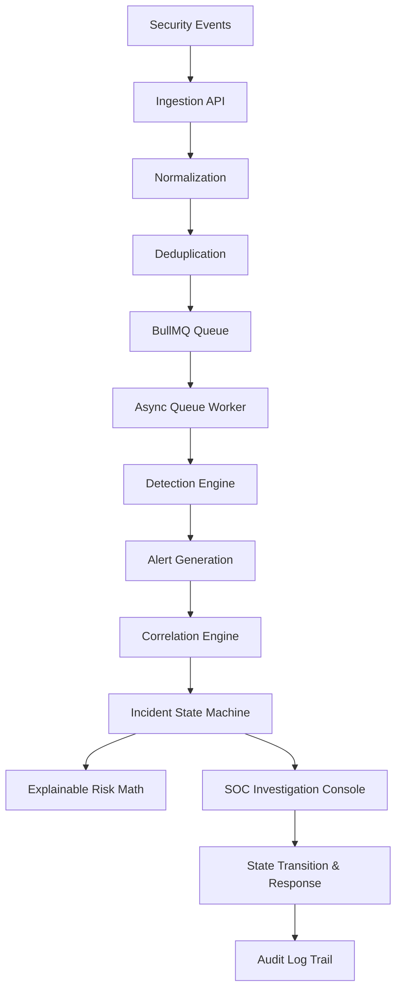
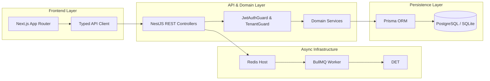

# ThreatSync OS

> Full-stack SOC platform for security event ingestion, deterministic detection, alert correlation, explainable risk scoring, incident investigation, and auditable response.

---

## Technical Overview & Architecture

ThreatSync OS is an engineering project demonstrating a multi-tenant Security Operations Center (SOC) investigation platform. It provides structured security event ingestion, rule-based detection, incident correlation, risk calculation, and an analyst investigation console.

### End-to-End Processing Pipeline



### System Stack Architecture



---

## Why This Project Is Engineering-Interesting

- **Server-Enforced Multi-Tenant Isolation**: Multi-tenancy is enforced server-side via `TenantGuard` and `TenantScopedRepository`. Bypassing tenant authorization via parameter or resource ID manipulation in the browser is impossible.
- **Deterministic Detection & Correlation**: Security alerts are generated deterministically by evaluating normalized event attributes against active tenant detection rules, rather than rendering random mockup data.
- **Explainable Asset Risk Scoring**: Asset risk scores are calculated using a transparent mathematical formula factoring in active alert severity weights, business criticality, and open vulnerability CVE findings.
- **Asynchronous Telemetry Ingestion**: Ingested events pass through BullMQ/Redis queues with job deduplication, exponential backoff retries, request correlation tracking, and production Redis boundary enforcement.
- **Evidence-Backed Entity Tracing**: Analysts can trace entity relationships in both directions across the entire stack: `Incident` → `Alerts` → `Security Events` → `Affected Assets` → `User Identities` → `IOC Indicators` → `Audit History`.
- **Fail-Closed Security & Auditability**: Every privileged operation, authentication, state transition, and assignment change generates an immutable `AuditLog` entry.

---

## Tech Stack

### Frontend (`apps/web`)
- **Framework**: Next.js 14 (App Router) with React & TypeScript
- **Styling**: Vanilla Tailwind CSS with custom dark SOC design tokens
- **Data Visualization**: Recharts, ReactFlow (Threat Propagation Canvas)
- **Icons**: Lucide React
- **API Access**: Centralized Typed API Client (`apps/web/lib/api-client.ts`)

### Backend (`apps/api`)
- **Framework**: NestJS API Gateway with REST Controllers & Dependency Injection
- **Database & ORM**: Prisma ORM with PostgreSQL / SQLite fallback
- **Queue Infrastructure**: BullMQ with `ioredis` client
- **Security**: Custom JWT Session Validation, Cookie Parser, bcryptjs, Class Validator

### Workspace Monorepo
- **Orchestration**: `npm` workspaces
- **Shared Types**: `packages/shared-types`
- **Database Model**: `packages/database`

---

## Security & Tenant Isolation Architecture

```text
HTTP Request
  │
  ▼
JwtAuthGuard (Validates Bearer token or HttpOnly Cookie session)
  │
  ▼
TenantGuard (Extracts organizationId from JWT & verifies active membership)
  │
  ▼
NestJS Controller (Injects AuthenticatedRequest & ActiveMember)
  │
  ▼
TenantScopedRepository (Binds this.organizationId to service request context)
  │
  ▼
Prisma Database Query (Appends 'where: { organizationId: this.organizationId }')
```

1. **Fail-Closed Authorization**: If a user attempts to access an incident, alert, or asset belonging to another tenant (IDOR attack), the service query fails to match `organizationId` and throws `404 Not Found`.
2. **Backend-Authoritative Fields**: Security-critical fields (`organizationId`, `userId`, `actorId`, `riskScore`, `auditLog`) are strictly derived server-side from the authenticated token context and domain logic, never trusted from client mutation bodies.

---

## Security Investigation Walkthrough

The development seeder populates a deterministic, traceable attack scenario:

```text
EVENT: Suspicious process execution & Kerberos anomaly
  │
  ▼
DETECTION: Rule match 'Failed administrator kerberos ticket request'
  │
  ▼
ALERT: High-severity alert raised on 192.0.2.10 (Asset: dc-01.threatsync.local)
  │
  ▼
CORRELATION: Multi-vector correlation groups alerts into Incident #1
  │
  ▼
INCIDENT: 'Critical Active Directory Domain Administrator Privilege Escalation'
  │
  ▼
RISK & IOC: Asset risk score escalates to 82.5%; IOC IP 198.51.100.99 enriched
  │
  ▼
RESPONSE: Analyst updates incident state from OPEN → TRIAGED and adds investigation note
  │
  ▼
AUDIT: Immutable audit log recorded with actor email, request ID, and status diff
```

---

## Capability & Implementation Scope

| Capability | Status | Implementation Details |
| :--- | :--- | :--- |
| **Security Event Ingestion** | Implemented | Ingestion endpoint `POST /events/ingest` with batch & async support |
| **Event Normalization** | Implemented | Normalizes IP addresses, hostnames, timestamps, and severity levels |
| **Event Deduplication** | Implemented | SHA-256 fingerprinting prevents duplicate queue entries |
| **Detection Rule Evaluation** | Implemented | Evaluates normalized events against active tenant `DetectionRule` set |
| **Alert Generation** | Implemented | Generates structured `Alert` records with calculated confidence scores |
| **Correlation Engine** | Implemented | Groups multi-vector alerts into `Incident` records by entity matching |
| **Explainable Risk Scoring** | Implemented | Formula combining alert weights, asset criticality, and open CVEs |
| **Incident Investigation Console** | Implemented | Entity relationship tracing across alerts, assets, IOCs, and events |
| **Incident State Machine** | Implemented | Strict lifecycle transitions (`OPEN` → `TRIAGED` → `INVESTIGATING` → `CONTAINED` → `RESOLVED` → `CLOSED`) |
| **Multi-Tenant Authorization** | Implemented | `TenantGuard` and `TenantScopedRepository` enforce server-side scope |
| **Async Queue & Worker** | Implemented | BullMQ queue with exponential backoff retries & dead-letter handling |
| **Redis Production Boundary** | Implemented | Requires real Redis host in production; local memory queue dev fallback |
| **Audit Logging** | Implemented | Every privileged mutation creates an immutable `AuditLog` entry |
| **External Threat Intelligence** | Provider Abstraction | VirusTotal/AbuseIPDB provider abstraction with mock fallback |
| **Live SIEM / EDR Connectors** | Out of Scope | Demo seeder provides standard telemetry JSON inputs |
| **Autonomous Remediation** | Out of Scope | Response actions are human analyst-driven via UI controls |

---

## Demo Setup & Prerequisites

### Prerequisites
- Node.js >= 18.x
- npm >= 9.x
- Local Redis (optional in dev mode when `ENABLE_IN_MEMORY_QUEUE_FALLBACK=true`)

### Environment Setup
1. Clone the repository and install dependencies:
   ```bash
   npm install
   ```

2. Copy the environment configuration:
   ```bash
   cp .env.example .env
   ```

3. Generate Prisma Client and sync schema:
   ```bash
   npm run db:generate
   npm run db:push
   ```

4. Seed developer demo credentials and data:
   ```bash
   npm run db:seed
   ```

5. Launch development servers:
   ```bash
   npm run dev:api   # API running on http://localhost:3001
   npm run dev:web   # Console running on http://localhost:3000
   ```

### Demo Login Credentials
- **Email**: `analyst@threatsync.local`
- **Password**: `ThreatSyncSecured2026!`

---

### Recommended 90-Second Demo Walkthrough

1. Open `http://localhost:3000` and click **Launch Console**.
2. Log in using `analyst@threatsync.local` / `ThreatSyncSecured2026!`.
3. Review the **Overview** dashboard (`/dashboard`) showing active alerts, critical assets, and incident metrics.
4. Navigate to **Alerts** (`/dashboard/alerts`) and open `Failed administrator kerberos ticket request` (`/dashboard/alerts/[id]`).
5. Inspect rule evidence, matched conditions, confidence score, and contributing IP `192.0.2.10`.
6. Click the linked Incident badge to navigate into **Incident Investigation** (`/dashboard/incidents/[id]`).
7. Review the **Timeline** tab displaying the chronological sequence of triggering events and alerts.
8. Switch to **Assets & Vulnerabilities**, click `dc-01.threatsync.local` (`/dashboard/assets/[id]`) to view risk score (`82.5%`) and `CVE-2021-44228` Log4Shell exposure.
9. Click IOC `198.51.100.99` (`/dashboard/ioc/[id]`) to view threat intelligence enrichments.
10. Return to the Incident detail page, open **Response Controls**, click `Transition to TRIAGED`, and post an analyst note.
11. Navigate to **Audit Logs** (`/dashboard/audit`) and verify the newly logged `INCIDENT_STATUS_TRANSITION` audit record with clickable entity route `/dashboard/incidents/[id]`.

---

## Technical Documentation (`docs/`)

- [`docs/ARCHITECTURE.md`](file:///c:/Users/prasu/Downloads/threat/docs/ARCHITECTURE.md): System layer breakdown, monorepo layout, and data pipeline.
- [`docs/SECURITY_MODEL.md`](file:///c:/Users/prasu/Downloads/threat/docs/SECURITY_MODEL.md): Authentication, tenant isolation, RBAC, anti-IDOR protections, and audit logging.
- [`docs/EVENT_PIPELINE.md`](file:///c:/Users/prasu/Downloads/threat/docs/EVENT_PIPELINE.md): Ingestion API, normalization, BullMQ queue, detection rules, and risk formula.
- [`docs/INVESTIGATION.md`](file:///c:/Users/prasu/Downloads/threat/docs/INVESTIGATION.md): SOC analyst investigation workflows, entity tracing, and state machine transitions.
- [`docs/LIMITATIONS.md`](file:///c:/Users/prasu/Downloads/threat/docs/LIMITATIONS.md): Transparent technical limitations, local fallbacks, and scope boundaries.
- [`docs/API_CONTRACTS.md`](file:///c:/Users/prasu/Downloads/threat/docs/API_CONTRACTS.md): REST API endpoints, query parameters, payload schemas, and response DTOs.

---

## Workspace Directory Layout

```text
threatsync-os/
├── apps/
│   ├── api/          # NestJS API backend, queue worker, auth guards, domain services
│   └── web/          # Next.js App Router SOC console, investigation pages, API client
├── packages/
│   ├── database/     # Prisma schema, SQLite/PostgreSQL client, seeder script
│   └── shared-types/ # Shared TypeScript DTOs, interfaces, and contracts
├── docs/             # Technical architectural & security specifications
├── package.json      # Workspace runner configuration
└── .env.example      # Example environment parameters
```

---

## Resume Summary

- **Full-Stack SOC Platform Architecture**: Built a multi-tenant security operations platform using Next.js 14, NestJS, and Prisma, supporting security event ingestion, deterministic rule detection, alert correlation, incident investigation, and explainable asset risk scoring.
- **Server-Side Security & Tenant Isolation**: Implemented fail-closed tenant-scoped authorization (`TenantGuard` & `TenantScopedRepository`), anti-IDOR protection, auditable incident lifecycle state machine transitions, and evidence-backed entity tracing.
- **Asynchronous Telemetry Pipeline**: Designed an asynchronous telemetry ingestion architecture using BullMQ and Redis with job deduplication, exponential backoff retries, correlation ID tracing, and production Redis boundary enforcement.
