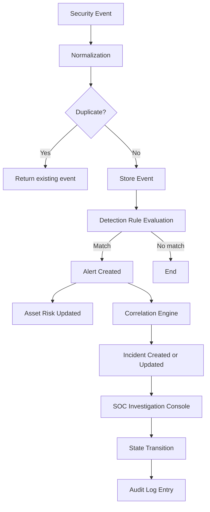
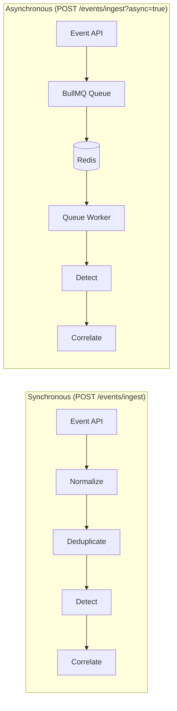

# ThreatSync OS

**Full-stack security operations and investigation platform** — event ingestion, deterministic detection, evidence-backed alert correlation, explainable risk scoring, incident investigation, and auditable response.

> **This is an engineering portfolio project.** It demonstrates a realistic SOC backend architecture with a full analyst investigation console. It is not connected to live SIEM/EDR infrastructure.

[](#tests) [](#tech-stack) [](LICENSE)

---

## What is ThreatSync OS?

ThreatSync OS models the core data flows and investigation workflows of a Security Operations Center platform:

- **Ingest** security events from endpoints, auth providers, and cloud services
- **Detect** threat patterns against configurable detection rules
- **Correlate** alerts into evidence-backed incident files
- **Score** asset risk with an explainable contributor breakdown
- **Investigate** across the full entity graph: Event → Alert → Incident → Asset → IOC → Audit
- **Respond** via analyst-controlled state transitions that generate audit records

---

## System at a Glance

### Detection & Investigation Pipeline



### Synchronous vs Asynchronous Paths



### Full Stack Layers

```
Next.js App Router (SOC Console)
         │
  Typed API Client (api-client.ts)
         │
  NestJS REST Controllers
         │
  JwtAuthGuard + TenantGuard
         │
  Domain Services (Request-Scoped)
         │
  TenantScopedRepository
         │
  Prisma ORM → PostgreSQL / SQLite
```

---

## What Makes This Engineering-Interesting

### 1. Deterministic Detection, Not Random Demo Data

Alerts are generated by evaluating normalized event attributes against stored `DetectionRule` records.  
The rule evaluator checks `matchConditions` (category, outcome, process name, attempt thresholds, IOC match flags).  
No alert is fabricated. If a rule doesn't match, no alert is created.  
→ [`events.service.ts`](apps/api/src/events/events.service.ts) — `runDetections()`, `matchRule()`, `matchesExplicitConditions()`

### 2. Explainable Risk Scoring

Asset risk is not an opaque number. The `buildRiskSummary()` method returns a `contributors` array, each with `label`, `score`, and `reason`.  
Contributors: business criticality weight + active alert severity sum + CVSS-based vulnerability score + linked incident count.  
→ [`assets.service.ts`](apps/api/src/assets/assets.service.ts) — `buildRiskSummary()`

```
Risk = criticalityWeight
     + Σ(alertSeverityWeights)
     + Σ(cvssScore × 1.6 per open CVE)
     + incidentCount × 8
```

### 3. Tenant Isolation Enforced at Repository Layer

Every service extends `TenantScopedRepository`. The `organizationId` getter resolves from the verified JWT member context — not from any client-supplied parameter. Database queries unconditionally append `organizationId: this.organizationId`.  
If tenant context is missing, the getter throws before any query executes.  
→ [`tenant-scoped.repository.ts`](apps/api/src/common/tenant-scoped.repository.ts)

### 4. Fail-Closed IDOR Protection

Cross-tenant resource access doesn't return `403 Forbidden` — it returns `404 Not Found`. This prevents an attacker from confirming whether a resource ID exists in another tenant.  
→ All `findFirst({ where: { id, organizationId } })` patterns in service files

### 5. Idempotent Queue Workers

The async worker checks for an existing `Alert` matching the incoming `eventId` before creating anything. Duplicate job delivery (BullMQ at-least-once guarantee) is handled without double-processing.  
→ [`queue.worker.ts`](apps/api/src/queues/queue.worker.ts)

### 6. Production Redis Boundary

`QueueService` throws at startup if `NODE_ENV=production`, `REDIS_URL` is missing, and `ENABLE_IN_MEMORY_QUEUE_FALLBACK` is not explicitly set to `true`. The server will not start silently with mock infrastructure in production.  
→ [`queue.service.ts`](apps/api/src/queues/queue.service.ts) — `onModuleInit()`

### 7. Threat Intelligence Provider Abstraction

`LocalThreatIntelProvider` and `ExternalThreatIntelProvider` implement the same interface. Services use the local provider by default. External providers require configuration. The distinction is explicit in the investigation response (`source: 'LOCAL_INTELLIGENCE' | 'EXTERNAL_INTELLIGENCE'`).  
→ [`threat-intel.provider.ts`](apps/api/src/intelligence/threat-intel.provider.ts)

### 8. Auditable Incident State Machine

Valid incident state transitions are defined in a static `ALLOWED_STATUS_TRANSITIONS` map. Attempting an invalid transition (e.g., `CLOSED → INVESTIGATING` outside allowed paths) throws `400 BadRequestException`. Every successful transition writes an `INCIDENT_STATUS_TRANSITION` audit record with `previousValues` and `newValues`.  
→ [`incidents.service.ts`](apps/api/src/incidents/incidents.service.ts) — `update()`, `ALLOWED_STATUS_TRANSITIONS`

---

## Security Architecture

### Request Lifecycle

```
Incoming HTTP Request
  │
  ├── JwtAuthGuard
  │     Validates JWT from Authorization header or HttpOnly cookie.
  │     Attaches user + organization membership to request context.
  │
  ├── TenantGuard
  │     Verifies request.member.organizationId is present.
  │     Throws ForbiddenException if no active organization context.
  │
  ├── NestJS Controller
  │     Passes AuthenticatedRequest to the service layer.
  │
  ├── TenantScopedRepository (extended by every service)
  │     Resolves organizationId from request — never from client input.
  │     Throws if accessed outside an authenticated tenant scope.
  │
  ├── Prisma Query
  │     Every query includes: where: { organizationId: this.organizationId }
  │
  └── AuditLog
        Privileged mutations write an immutable audit record.
```

### Concrete Protections

| Protection | Implementation |
|:--|:--|
| JWT Authentication | `JwtAuthGuard` validates Bearer token and HttpOnly cookie sessions |
| Tenant Resolution | `organizationId` resolved from verified JWT membership, not URL/body |
| IDOR Prevention | `findFirst({ where: { id, organizationId } })` — returns `404` not `403` |
| Analyst Membership Validation | `assignedAnalystId` verified against `organizationMember` before assignment |
| Backend-Authoritative State | `status`, `riskScore`, `organizationId`, `auditLog` are never trusted from client |
| State Machine Enforcement | Invalid transitions throw `BadRequestException` before any DB write |
| Audit Logging | All privileged mutations create `AuditLog` records with actor, timestamp, diff |

---

## Failure & Recovery Behavior

| Scenario | Actual Behavior |
|:--|:--|
| **Duplicate event ingested** | Deduplication query matches event within 5-minute window → returns existing event, skips detection, logs `EVENT_INGESTION_DUPLICATE` |
| **Duplicate async job delivered** | Worker checks for existing `Alert` by `eventId` → idempotently skips, returns `{ status: 'skipped_duplicate' }` |
| **Invalid event payload** | `normalizeEvent()` applies safe defaults; unknown severity maps to `LOW`; missing fields do not panic |
| **Unauthorized request (no JWT)** | `JwtAuthGuard` throws `401 UnauthorizedException` |
| **Cross-tenant resource access (IDOR)** | `findFirst({ id, organizationId })` returns `null` → service throws `404 NotFoundException` |
| **Invalid incident state transition** | `BadRequestException` with allowed transitions listed; no DB write occurs |
| **Missing Redis in production** | `QueueService.onModuleInit()` throws at startup — server does not boot |
| **Redis connection failure (dev)** | Falls back to `ioredis-mock` with warning log if `ENABLE_IN_MEMORY_QUEUE_FALLBACK=true` |
| **External intelligence unavailable** | `ExternalThreatIntelProvider` returns `null`; investigation response marks `source: 'UNAVAILABLE'` |
| **External intelligence provider error** | Provider catches error internally; investigation continues with local intelligence only |
| **Failed comment/task mutation** | Service validates incident `organizationId` membership before write; throws `NotFoundException` if not found |

---

## Tech Stack

**Frontend (`apps/web`)**
- Next.js 14 App Router, React 18, TypeScript
- Tailwind CSS with custom dark SOC design tokens
- Recharts (severity/incident charts), ReactFlow (threat propagation graph)
- Lucide React icons
- Centralized typed API client (`apps/web/lib/api-client.ts`)

**Backend (`apps/api`)**
- NestJS with request-scoped dependency injection
- JWT authentication via `@nestjs/jwt`
- BullMQ queue with `ioredis` client
- `bcryptjs` for password hashing, `cookie-parser`, `class-validator`

**Database & Schema**
- Prisma ORM targeting PostgreSQL (SQLite in local development)
- Shared TypeScript types in `packages/shared-types`

**Testing**
- Jest with custom service-layer mocks
- 7 test suites, 76 passing tests across: auth, tenant isolation, queue hardening, event detection, investigation, threat intelligence

---

## Engineering Metrics

| Metric | Value | Verified |
|:--|:--|:--|
| Test suites | 7 | ✓ |
| Passing tests | 76 | ✓ |
| API domain modules | 10 (auth, events, alerts, incidents, assets, intelligence, vulnerabilities, organizations, audit, health) | ✓ |
| Investigation entity types | 7 (Incident, Alert, Event, Asset, IOC, Vulnerability, Audit) | ✓ |
| Queue types | 2 (`telemetry-ingestion`, `alert-escalation`) | ✓ |
| Incident lifecycle states | 8 (OPEN → TRIAGED → INVESTIGATING → CONTAINMENT_IN_PROGRESS → CONTAINED → REMEDIATION_IN_PROGRESS → MONITORING → RESOLVED → CLOSED) | ✓ |
| Frontend investigation consoles | 4 (Alert, Incident, Asset, IOC) | ✓ |
| Documented API contracts | [`docs/API_CONTRACTS.md`](docs/API_CONTRACTS.md) | ✓ |

---

## Key Design Decisions

**Next.js + NestJS monorepo**  
→ Both share `packages/shared-types`, eliminating DTO drift. The workspace setup means one `npm install` runs everything.  
→ Tradeoff: NestJS request-scoped services add overhead; acceptable for a correctness-first architecture.

**Prisma over raw SQL**  
→ Schema-first migrations, type-safe queries, and multi-database support (SQLite locally, PostgreSQL in production) without changing service code.  
→ Tradeoff: Prisma's `findFirst` with complex `OR` conditions can be verbose; raw SQL would be more expressive for the event search endpoint.

**`packages/shared-types`**  
→ API response shapes are defined once and imported by both the NestJS controllers and the Next.js API client. Type drift between backend and frontend is a compile error, not a runtime surprise.

**Centralized API client (`apps/web/lib/api-client.ts`)**  
→ All HTTP calls go through one file. Authorization headers, error propagation, and session logic are in one place. Pages don't contain raw `fetch()` calls.  
→ Tradeoff: The client is not a full query library (no caching, no deduplication). That's appropriate — this is not an SPA with complex client-side state.

**BullMQ + Redis for async ingestion**  
→ High-volume event ingestion shouldn't block the HTTP response. BullMQ provides reliable at-least-once delivery with exponential backoff retries and job ID-based idempotency.  
→ Tradeoff: BullMQ is heavier than a simple task queue. The idempotency check in the worker compensates for at-least-once delivery.

**Deterministic local intelligence**  
→ The investigation console works without external API keys. `LocalThreatIntelProvider` queries the organization's own IOC database. The provider interface means an external VirusTotal/AbuseIPDB provider can be swapped in via configuration.  
→ Tradeoff: Local intelligence is only as good as what's been ingested. It won't detect unknown indicators.

**Request-scoped services for tenant isolation**  
→ Services injected with `Scope.REQUEST` receive a fresh instance per HTTP request, with the tenant `organizationId` bound to that request's JWT context. No cross-request state leakage is possible.  
→ Tradeoff: Request-scoped providers cannot be singleton. BullMQ worker processes bypass this by resolving tenant context from the job payload and validating it against the database.

**Explicit incident state transitions**  
→ State changes are validated against `ALLOWED_STATUS_TRANSITIONS` before any write. This prevents invalid states (e.g., `RESOLVED → CONTAINMENT_IN_PROGRESS`) and creates a deterministic audit trail.  
→ Tradeoff: Analysts cannot skip states even if a workflow demands it. This is a deliberate correctness constraint.

---

## Capability Scope

| Capability | Status |
|:--|:--|
| Security event ingestion & normalization | ✅ Implemented |
| Event deduplication (5-minute window) | ✅ Implemented |
| Detection rule evaluation | ✅ Implemented |
| Confidence scoring per alert | ✅ Implemented |
| Rule suppression periods | ✅ Implemented |
| Alert correlation into incidents | ✅ Implemented |
| Duplicate incident prevention | ✅ Implemented |
| Explainable asset risk scoring | ✅ Implemented |
| Multi-tenant authorization | ✅ Implemented |
| IDOR protection (fail-closed) | ✅ Implemented |
| Incident state machine | ✅ Implemented |
| Audit logging for mutations | ✅ Implemented |
| Investigation timelines (deterministic) | ✅ Implemented |
| Async queue processing (BullMQ) | ✅ Implemented |
| Idempotent queue workers | ✅ Implemented |
| Production Redis boundary enforcement | ✅ Implemented |
| Threat intelligence provider abstraction | ✅ Implemented |
| External threat intelligence (VirusTotal/AbuseIPDB) | ⚙️ Provider abstraction — requires API key configuration |
| Live SIEM/EDR connectors | ❌ Out of scope — seeder provides representative data |
| Autonomous remediation | ❌ Out of scope — analyst-driven via UI controls |
| Real production telemetry | ❌ Out of scope — not connected to live infrastructure |

---

## Demo Setup

### Prerequisites
- Node.js ≥ 18, npm ≥ 9
- Redis (optional in dev — set `ENABLE_IN_MEMORY_QUEUE_FALLBACK=true` to skip)
- PostgreSQL or SQLite (SQLite configured by default)

### Setup

```bash
# 1. Install all workspace dependencies
npm install

# 2. Configure environment
cp .env.example .env
# Edit .env — set DATABASE_URL and JWT_SECRET at minimum

# 3. Generate Prisma client and push schema
npm run db:generate
npm run db:push

# 4. Seed development data
npm run db:seed
# → Creates analyst@threatsync.local / ThreatSyncSecured2026!
# → Populates 50 assets, 150 alerts, 12 incidents, 500 events, 25 IOCs (DEMO DATA)

# 5. Launch development servers
npm run dev:api    # http://localhost:3001
npm run dev:web    # http://localhost:3000
```

### Demo Login
> **Development credentials only — not for production use**
- Email: `analyst@threatsync.local`
- Password: `ThreatSyncSecured2026!`

### Recommended Walkthrough (90 seconds)

1. **Overview** (`/dashboard`) — active alerts, open incidents, asset risk distribution
2. **Alerts** (`/dashboard/alerts`) — open `Failed administrator kerberos ticket request`
3. **Alert detail** (`/dashboard/alerts/[id]`) — detection rule, confidence score, source IP
4. **Incident** — follow the linked incident badge
5. **Incident Timeline** — chronological sequence: event → detection → alert → triage actions
6. **Assets & Risk tab** — click `dc-01.threatsync.local` → risk score 82.5%, CVE-2021-44228
7. **IOC** — inspect `198.51.100.99` → enrichment data, observed alerts, related events
8. **Response Controls tab** — transition incident from `OPEN` → `TRIAGED`
9. **Add analyst note** — post an investigation observation
10. **Audit** (`/dashboard/audit`) — confirm `INCIDENT_STATUS_TRANSITION` audit entry with entity link

---

## Code Navigation for Reviewers

| If you want to understand | Start here |
|:--|:--|
| Event ingestion, normalization, deduplication | [`apps/api/src/events/events.service.ts`](apps/api/src/events/events.service.ts) |
| Detection rule evaluation & confidence scoring | [`apps/api/src/events/events.service.ts`](apps/api/src/events/events.service.ts) — `runDetections()`, `matchRule()` |
| Alert correlation into incidents | [`apps/api/src/queues/correlation.service.ts`](apps/api/src/queues/correlation.service.ts) |
| Explainable risk score formula | [`apps/api/src/assets/assets.service.ts`](apps/api/src/assets/assets.service.ts) — `buildRiskSummary()` |
| Tenant isolation & IDOR protection | [`apps/api/src/common/tenant-scoped.repository.ts`](apps/api/src/common/tenant-scoped.repository.ts) |
| Authentication & tenant guard | [`apps/api/src/auth/tenant.guard.ts`](apps/api/src/auth/tenant.guard.ts), [`jwt-auth.guard.ts`](apps/api/src/auth/jwt-auth.guard.ts) |
| Incident state machine & audit records | [`apps/api/src/incidents/incidents.service.ts`](apps/api/src/incidents/incidents.service.ts) |
| Investigation entity graph (Alert/Incident/Asset/IOC) | [`apps/api/src/investigation/`](apps/api/src/investigation/) |
| Async BullMQ queue setup & Redis boundary | [`apps/api/src/queues/queue.service.ts`](apps/api/src/queues/queue.service.ts) |
| Async worker with idempotency & tenant validation | [`apps/api/src/queues/queue.worker.ts`](apps/api/src/queues/queue.worker.ts) |
| Threat intelligence provider abstraction | [`apps/api/src/intelligence/threat-intel.provider.ts`](apps/api/src/intelligence/threat-intel.provider.ts) |
| Centralized typed frontend API client | [`apps/web/lib/api-client.ts`](apps/web/lib/api-client.ts) |
| Incident investigation console | [`apps/web/app/dashboard/incidents/[id]/page.tsx`](apps/web/app/dashboard/incidents/%5Bid%5D/page.tsx) |
| Investigation timeline component | [`apps/web/components/InvestigationTimeline.tsx`](apps/web/components/InvestigationTimeline.tsx) |
| Security & tenant isolation tests | [`apps/api/src/investigation/investigation.spec.ts`](apps/api/src/investigation/investigation.spec.ts) |
| Queue hardening tests | [`apps/api/src/queues/queue-hardening.spec.ts`](apps/api/src/queues/queue-hardening.spec.ts) |

---

## Technical Documentation

| Document | Contents |
|:--|:--|
| [`docs/ARCHITECTURE.md`](docs/ARCHITECTURE.md) | System layers, monorepo layout, entity relationships |
| [`docs/SECURITY_MODEL.md`](docs/SECURITY_MODEL.md) | Auth flow, tenant isolation, RBAC, IDOR protections, audit |
| [`docs/EVENT_PIPELINE.md`](docs/EVENT_PIPELINE.md) | Ingestion, normalization, detection, async queue, risk math |
| [`docs/INVESTIGATION.md`](docs/INVESTIGATION.md) | Entity tracing, investigation APIs, timeline construction |
| [`docs/LIMITATIONS.md`](docs/LIMITATIONS.md) | Honest scope boundaries, local fallbacks, dev-only data |
| [`docs/API_CONTRACTS.md`](docs/API_CONTRACTS.md) | REST endpoints, query parameters, payload schemas, responses |

---

## Engineering Questions This Project Supports

These are questions a technical interviewer could legitimately ask based on the implementation:

1. How does tenant isolation work, and where specifically is `organizationId` bound?
2. Why does the system return `404` instead of `403` for cross-tenant access attempts?
3. How is event deduplication implemented, and what is the window?
4. How are detection rules evaluated — what determines a match?
5. How is alert confidence score calculated?
6. How does the correlation engine decide whether to create a new incident vs. attach to an existing one?
7. How is risk score calculated, and what are the contributor categories?
8. Why use BullMQ for async ingestion rather than processing synchronously?
9. How does the worker prevent duplicate processing from BullMQ's at-least-once delivery?
10. What happens if Redis is unavailable in production — specifically at startup?
11. Why use a provider abstraction for threat intelligence?
12. How does the incident state machine prevent invalid transitions?
13. Why use request-scoped NestJS services for tenant isolation?
14. How would you add a new detection rule category?
15. What would you change before deploying this to handle real production load?

---

## What I Would Build Next

These are not implemented. Listed to demonstrate engineering judgment:

- **Real SIEM/EDR connectors** — webhook receivers for CrowdStrike, Splunk, Elastic SIEM events
- **Production threat intelligence** — live VirusTotal/AbuseIPDB enrichment with rate-limit handling and cache TTL
- **Event streaming** — Kafka or Kinesis for durable high-volume telemetry ingest
- **Horizontal worker scaling** — multiple BullMQ worker instances with concurrency tuning
- **Observability** — structured logging (Pino), distributed tracing (OpenTelemetry), queue depth metrics
- **Retention policies** — configurable event/audit log TTL with archival to cold storage
- **Deployment infrastructure** — Docker Compose, Kubernetes manifests, Redis Sentinel/Cluster config
- **Secrets management** — Vault or AWS Secrets Manager integration instead of `.env` files
- **Automated response integrations** — ticketing system (Jira/PagerDuty) integration for incident escalation

---

## Repository Layout

```
threat/
├── apps/
│   ├── api/          # NestJS REST API, queue workers, domain services, auth guards
│   └── web/          # Next.js App Router SOC console, investigation pages, API client
├── packages/
│   ├── database/     # Prisma schema, migrations, development seeder
│   └── shared-types/ # TypeScript interfaces shared between api and web
├── docs/             # Architecture, security, pipeline, investigation, limitations specs
├── .env.example      # Required environment variable reference
└── package.json      # Workspace configuration
```

---

## Tests

```bash
npm test --workspaces --if-present -- --runInBand
```

```
PASS src/intelligence/threat-intel.provider.spec.ts
PASS src/auth/tenant.guard.spec.ts
PASS src/auth/jwt-auth.guard.spec.ts
PASS src/queues/queues.spec.ts
PASS src/events/events.service.spec.ts
PASS src/queues/queue-hardening.spec.ts
PASS src/investigation/investigation.spec.ts

Test Suites:  7 passed, 7 total
Tests:       76 passed, 76 total
```

---

## Resume Summary

- Built a multi-tenant SOC investigation platform using Next.js 14, NestJS, and Prisma — implementing security event ingestion with deterministic rule-based detection, multi-vector alert correlation, explainable asset risk scoring, and a full analyst investigation console across incidents, alerts, assets, IOCs, and vulnerabilities.
- Implemented server-side tenant isolation via request-scoped `TenantScopedRepository`, fail-closed IDOR protection, validated incident state machine transitions with audit records, and backend-authoritative field enforcement to prevent privilege escalation through client-supplied parameters.
- Designed an asynchronous telemetry ingestion pipeline using BullMQ and Redis with idempotent worker processing, exponential backoff retries, correlation ID tracing, and a hard production startup boundary preventing silent fallback to mock infrastructure.
