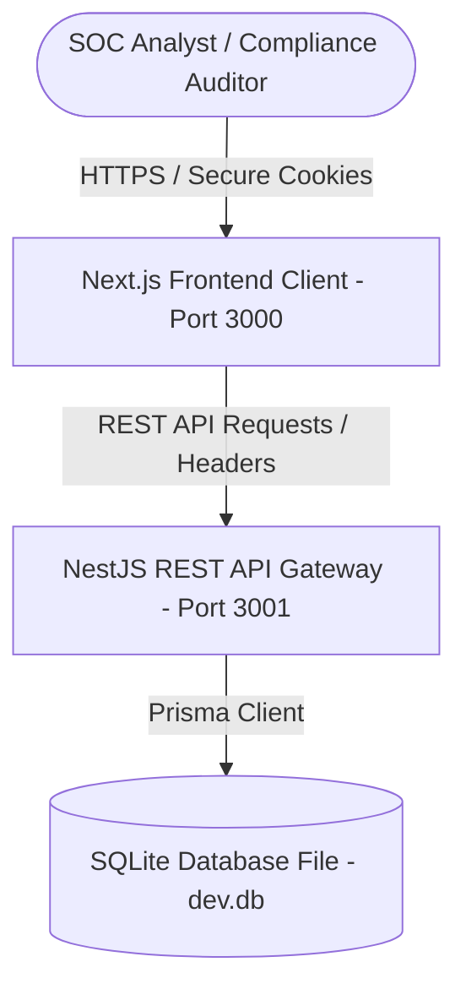
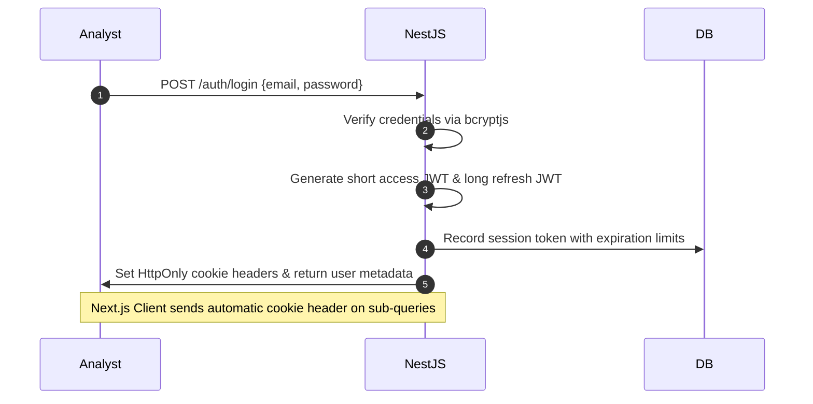
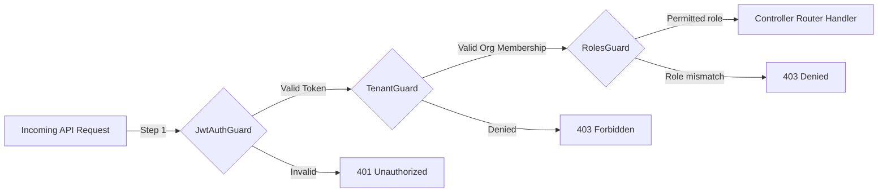

# ThreatSync OS Architecture Overview

This document details the software design, container flows, authentication mechanisms, and tenant isolation strategies of ThreatSync OS.

---

## 1. System Container Flow

ThreatSync OS is structured as a decoupled monorepo, keeping business controllers isolated from client components:

- **Frontend Client:** Next.js Server Components load state profiles, and Client Components handle real-time interactions, Recharts renderings, and forms.
- **REST API Gateway:** NestJS services parse requests, validate input validation constraints (class-validator), check session contexts, and query records.
- **ORM & Database:** Prisma intercepts queries and translates schemas.

---

## 2. Authentication Flow

Authentication is executed through secure cookie verification to prevent XSS exposure:

---

## 3. Tenant Isolation & RBAC Guard Pipeline

To prevent cross-tenant information disclosure, every request targeting organizational data is parsed through a strict validation chain:

- **JwtAuthGuard:** Extracts access tokens from request cookies or bearer headers, verifies signatures, and resolves the User identity context.
- **TenantGuard:** Extracts target organization ID (from headers, routes, queries, or body parameters). Queries database memberships to verify user access; attaches organization metadata to request parameters.
- **RolesGuard:** Compares user organization roles against controller metadata configs.
